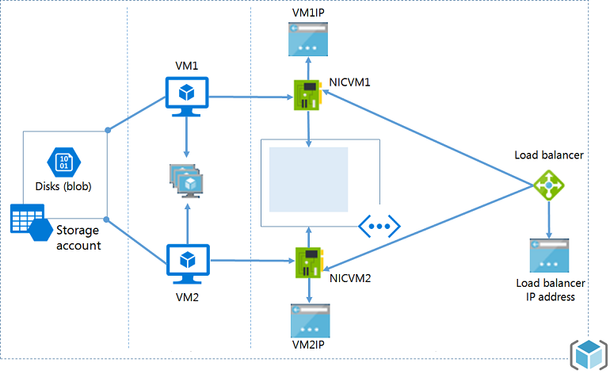

# Create Your First Resource Manager Template

Lets look at a very simple architecture:
* Two virtual machines that use the same storage account, are in the same availability set, and on the same subnet of a virtual network.
* A single NIC and VM IP address for each virtual machine.
* A load balancer with a load balancing rule on port 80



The full template can be found in this directory - [sample_arc_template.json](sample_arc_template.json)

## Virtual Network with one Subnet
```
 {
      "apiVersion": "2015-05-01-preview",
      "type": "Microsoft.Network/virtualNetworks",
      "name": "[parameters('vnetName')]",
      "location": "[resourceGroup().location]",
      "properties": {
        "addressSpace": {
          "addressPrefixes": [
            "[variables('addressPrefix')]"
          ]
        },
        "subnets": [
          {
            "name": "[variables('subnetName')]",
            "properties": {
              "addressPrefix": "[variables('subnetPrefix')]"
            }
          }
        ]
      }
  }
```
## Storage Account
```
  {
      "type": "Microsoft.Storage/storageAccounts",
      "name": "[parameters('storageAccountName')]",
      "apiVersion": "2015-05-01-preview",
      "location": "[resourceGroup().location]",
      "properties": {
        "accountType": "[variables('storageAccountType')]"
      }
  }
```
## Availability Set
```
 {
      "type": "Microsoft.Compute/availabilitySets",
      "name": "[variables('availabilitySetName')]",
      "apiVersion": "2015-05-01-preview",
      "location": "[resourceGroup().location]",
      "properties": { }
  }
```
## Public IP for the Load Balancer
```
  {
      "apiVersion": "2015-05-01-preview",
      "type": "Microsoft.Network/publicIPAddresses",
      "name": "[parameters('publicIPAddressName')]",
      "location": "[resourceGroup().location]",
      "properties": {
        "publicIPAllocationMethod": "[variables('publicIPAddressType')]",
        "dnsSettings": {
          "domainNameLabel": "[parameters('dnsNameforLBIP')]"
        }
      }
  }
```
## 2 Public IPs for the VMs
```
 {
      "apiVersion": "2015-05-01-preview",
      "type": "Microsoft.Network/publicIPAddresses",
      "name": "[concat(parameters('publicIPPrefix'), copyindex())]",
      "location": "[resourceGroup().location]",
      "copy": {
        "name": "ipLoop",
        "count": "[variables('numberOfInstances')]"
      },
      "properties": {
        "publicIPAllocationMethod": "[variables('publicIPAddressType')]",
        "dnsSettings": {
          "domainNameLabel": "[concat(parameters('dnsNameforPublicIP'), copyindex())]"
        }
      }
  }
```
## Load Balancer
```
{
      "apiVersion": "2015-05-01-preview",
      "name": "[parameters('lbName')]",
      "type": "Microsoft.Network/loadBalancers",
      "location": "[resourceGroup().location]",
      "dependsOn": [
        "[concat('Microsoft.Network/publicIPAddresses/', parameters('publicIPAddressName'))]"
      ],
      "properties": {
        "frontendIPConfigurations": [
          {
            "name": "LoadBalancerFrontEnd",
            "properties": {
              "publicIPAddress": {
                "id": "[variables('publicIPAddressID')]"
              }
            }
          }
        ],
        "backendAddressPools": [
          {
            "name": "BackendPool1"
          }
        ],
        "inboundNatRules": [
          {
            "name": "RDP-VM0",
            "properties": {
              "frontendIPConfiguration": {
                "id": "[variables('frontEndIPConfigID')]"
              },
              "protocol": "tcp",
              "frontendPort": 50001,
              "backendPort": 3389,
              "enableFloatingIP": false
            }
          },
          {
            "name": "RDP-VM1",
            "properties": {
              "frontendIPConfiguration": {
                "id": "[variables('frontEndIPConfigID')]"
              },
              "protocol": "tcp",
              "frontendPort": 50002,
              "backendPort": 3389,
              "enableFloatingIP": false
            }
          }
        ],
        "loadBalancingRules": [
          {
            "name": "LBRule",
            "properties": {
              "frontendIPConfiguration": {
                "id": "[variables('frontEndIPConfigID')]"
              },
              "backendAddressPool": {
                "id": "[variables('lbPoolID')]"
              },
              "protocol": "tcp",
              "frontendPort": 80,
              "backendPort": 80,
              "enableFloatingIP": false,
              "idleTimeoutInMinutes": 5,
              "probe": {
                "id": "[variables('lbProbeID')]"
              }
            }
          }
        ],
        "probes": [
          {
            "name": "tcpProbe",
            "properties": {
              "protocol": "tcp",
              "port": 80,
              "intervalInSeconds": 5,
              "numberOfProbes": 2
            }
          }
        ]
      }
  }
```
## 2 Network Interfaces
```
 {
      "apiVersion": "2015-05-01-preview",
      "type": "Microsoft.Network/networkInterfaces",
      "name": "[concat(parameters('nicNamePrefix'), copyindex())]",
      "location": "[resourceGroup().location]",
      "copy": {
        "name": "nicLoop",
        "count": "[variables('numberOfInstances')]"
      },
      "dependsOn": [
        "[concat('Microsoft.Network/virtualNetworks/', parameters('vnetName'))]",
        "[concat('Microsoft.Network/loadBalancers/', parameters('lbName'))]",
        "[concat('Microsoft.Network/publicIPAddresses/', parameters('publicIPPrefix'), copyindex())]"
      ],
      "properties": {
        "publicIPAddress": {
          "id": "[resourceId('Microsoft.Network/publicIPAddresses', concat(parameters('publicIPPrefix'), copyindex()))]"
        },
        "ipConfigurations": [
          {
            "name": "ipconfig1",
            "properties": {
              "privateIPAllocationMethod": "Dynamic",
              "subnet": {
                "id": "[variables('subnetRef')]"
              },
              "loadBalancerBackendAddressPools": [
                {
                  "id": "[concat(variables('lbID'), '/backendAddressPools/BackendPool1')]"
                }
              ],
              "loadBalancerInboundNatRules": [
                {
                  "id": "[concat(variables('lbID'),'/inboundNatRules/RDP-VM', copyindex())]"
                }
              ]
            }
          }
        ]
      }
  }
```
## 2 Virtual Machines
```
{
      "apiVersion": "2015-06-15",
      "type": "Microsoft.Compute/virtualMachines",
      "name": "[concat(parameters('vmNamePrefix'), copyindex())]",
      "copy": {
        "name": "virtualMachineLoop",
        "count": "[variables('numberOfInstances')]"
      },
      "location": "[resourceGroup().location]",
      "dependsOn": [
        "[concat('Microsoft.Storage/storageAccounts/', parameters('storageAccountName'))]",
        "[concat('Microsoft.Network/networkInterfaces/', parameters('nicNamePrefix'), copyindex())]",
        "[concat('Microsoft.Compute/availabilitySets/', variables('availabilitySetName'))]"
      ],
      "properties": {
        "availabilitySet": {
          "id": "[resourceId('Microsoft.Compute/availabilitySets',variables('availabilitySetName'))]"
        },
        "hardwareProfile": {
          "vmSize": "[parameters('vmSize')]"
        },
        "osProfile": {
          "computerName": "[concat(parameters('vmNamePrefix'), copyIndex())]",
          "adminUsername": "[parameters('adminUsername')]",
          "adminPassword": "[parameters('adminPassword')]"
        },
        "storageProfile": {
          "imageReference": {
            "publisher": "[parameters('imagePublisher')]",
            "offer": "[parameters('imageOffer')]",
            "sku": "[parameters('imageSKU')]",
            "version": "latest"
          },
          "osDisk": {
            "name": "osdisk",
            "vhd": {
              "uri": "[concat('http://',parameters('storageAccountName'),'.blob.core.windows.net/vhds/','osdisk', copyindex(), '.vhd')]"
            },
            "caching": "ReadWrite",
            "createOption": "FromImage"
          }
        },
        "networkProfile": {
          "networkInterfaces": [
            {
              "id": "[resourceId('Microsoft.Network/networkInterfaces',concat(parameters('nicNamePrefix'),copyindex()))]"
            }
          ]
        },
        "diagnosticsProfile": {
          "bootDiagnostics": {
            "enabled": "true",
            "storageUri": "[concat('http://',parameters('storageAccountName'),'.blob.core.windows.net')]"
          }
        }
      }
  }
```
