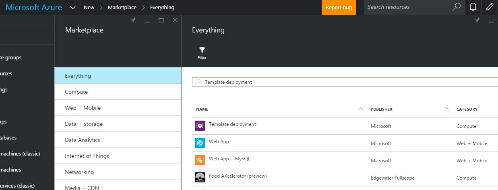
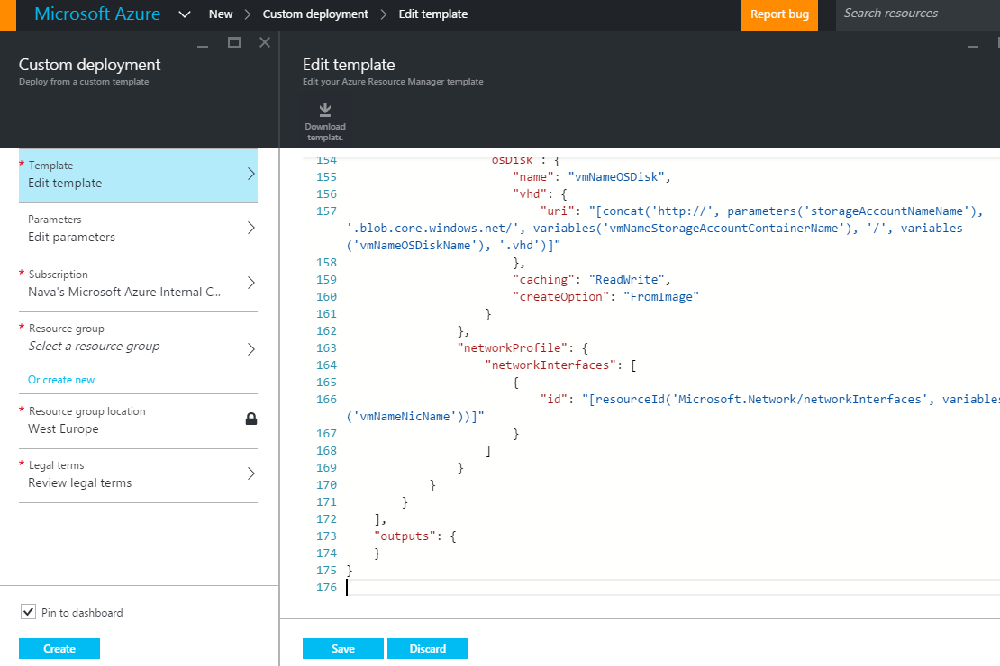

#  Deploying a Template
There are several ways to deploy a template, all described in details in the [Tools](../Tools/README.md) section of this document. You can also find examples in each programing language [SDK](../ARM/SDKs/README.md) section.
We will cover in high level some of the deployment methods, to get you started with deploying templates:
## Powershell
Azure PowerShell is currently available in two releases - 1.0 and 0.9.8. The examples in this section use the 1.0 version.
For information about the 1.0 release, including how to install and uninstall the release, see [Azure PowerShell 1.0 Preview](https://azure.microsoft.com/en-us/blog/azps-1-0-pre/). 

The following example will deploy a template file using a parameter file. In this example the template and parameters files are hosted localy:
```powershell
# login to azure account
Login-AzureRmAccount

# select your subscription
Select-AzureRmSubscription -SubscriptionID <YourSubscriptionId>

# create a new resource group, if one does not exist
New-AzureRmResourceGroup -Name ExampleResourceGroup -Location "West US"

# deploy the template using a parameter file
New-AzureRmResourceGroupDeployment -Name ExampleDeployment -ResourceGroupName ExampleResourceGroup -TemplateFile <PathOrLinkToTemplate> -TemplateParameterFile <PathOrLinkToParameterFile>
```

Deploy using inline parameters:
```powershell
New-AzureRmResourceGroupDeployment -Name ExampleDeployment -ResourceGroupName ExampleResourceGroup -TemplateFile <PathOrLinkToTemplate> -myParameterName "parameterValue"
```

Deploy using a parameters object:
```powershell
$parameters = @{"<ParameterName>"="<Parameter Value>"}
New-AzureRmResourceGroupDeployment -Name ExampleDeployment -ResourceGroupName ExampleResourceGroup -TemplateFile <PathOrLinkToTemplate> -TemplateParameterObject $parameters
```

Deploy with template and parameters file URIs:
```powershell
New-AzureRmResourceGroupDeployment -Name ExampleDeployment -ResourceGroupName ExampleResourceGroup -TemplateUri <template uri> -TemplateParameterUri <parameters file uri>
```
## Command Line Interface
I assume that you have some experiance with using the Azure CLI. if not, no harm - get started with [this](https://azure.microsoft.com/en-us/documentation/articles/xplat-cli-azure-resource-manager/) overview.
The follwoing deploys a local template file using inline parameters:
```bash
azure login
azure config mode arm

azure group create -n ExampleResourceGroup -l "West US"

azure group deployment create -f <PathToTemplate> -p "{\"ParameterName\":{\"value\":\"ParameterValue\"}}" -g ExampleResourceGroup -n ExampleDeployment
```
Deploy using a template URI:
```bash
azure group deployment create --template-uri <LinkToTemplate> -p "{\"ParameterName\":{\"value\":\"ParameterValue\"}}" -g ExampleResourceGroup -n ExampleDeployment
 ```
 
Deploying using a parameters file:
```bash
 azure group deployment create -f <PathToTemplate> -e <PathToParameterFile> -g ExampleResourceGroup -n ExampleDeployment
```

## Azure Portal
The Azure Portal allows you to deploy your own templates in a UI exepriance. 

1. In the azure Portal, go to the marketplace blade, and search for "Template Deployment":


2. Paste/write you template in the "Edit Template" section, update the parameters and deploy:


## Resorces and References
https://azure.microsoft.com/en-us/documentation/articles/resource-group-template-deploy/
https://azure.microsoft.com/en-us/blog/azps-1-0-pre/
